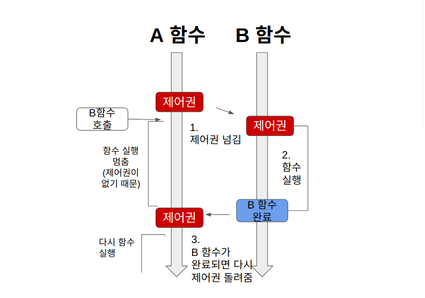
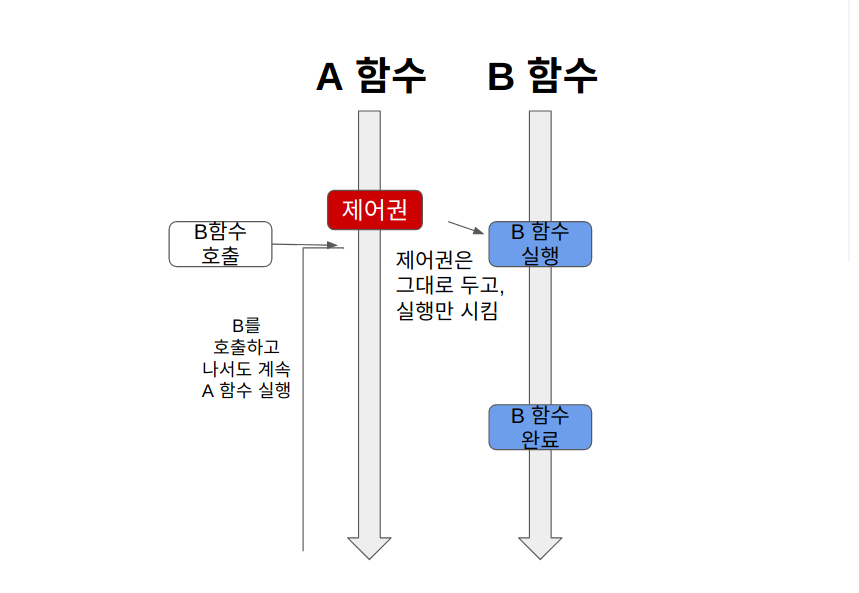
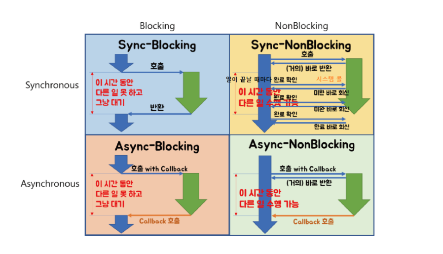

## 용어정리
### - 제어권
- 제어권은 자신이 자신의 코드를 실핼 할 수 있는 권리라고 이해하면 된다.   제어권이 있는 함수는 자신의 코드를 끝까지 실행 후, 자신을 호출한 함수에게 제어권을 돌려준다.
### - 결과값을 기다리는 것
- 호출한 함수가 호출된 함수의 결과값을 기다리는가의 여부를 의미한다.
## 동기, 비동기
### 동기(Sync), 비동기(Async)
- 동기와 비동기는 작업의 완료 여부를 신경쓰는지의 여부 차이이다.
#### 1. 동기
함수 A가 함수 B를 호출했을 때, 함수 A가 함수 B의 작업 완료 여부를 계속 확인하며, 신경쓰는 것
#### 2. 비동기
함수 A가 함수 B를 호출할 때, 콜백 함수를 함께 전달하여, 함수 B의 작업 완료 여부를 신경쓰지 않고,   함수 B가 작업을 완료하면 콜백함수를 호출하도록 하는 것
#### 3. 블록
블록(블록킹)은 호출한 함수가 호출된 함수에게 제어권을 넘겨주는 것을 의미한다. 

#### 4. 논블록
논블록(논블록킹)은 호출한 함수가 호출된 함수에게 제어권을 넘기지 않고 자신의 코드를 계속 진행하는 것을 의미한다.

  
  
### 조합 
블록, 논블록, 동기, 비동기는 조합이 가능하며 그 그림은 아래와 같다. 

