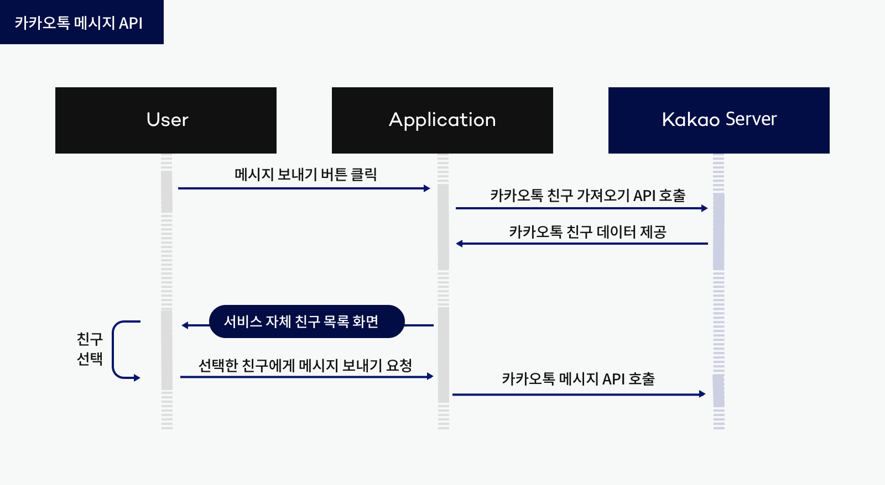

# 카카오톡도 웹소켓으로 동작할까?

## 내 생각
- 채팅 서비스는 보통 websocket을 사용하여 실시간 채팅을 구현하는걸로 알고있다.
- 카카오톡도 채팅 서비스니 웹소켓을 사용하지 않을까??
- 근데 카카오톡의 경우 굉장히 많은 사용자가 사용을 하고 있는데, 그럼 그 모든 websocket들을 다 열어놓고 있는건가?
- 웹소켓을 계속 열어놓고 있는다면 결국 heartbeat와 같은 통신이 계속해서 반복될텐데 그걸 다 감당하는건가?
  - 웹소켓은 결국 TCP 연결을 계속해서 유지하는 방식

## 찾아본 결과

카카오톡 공식 문서에서 제공하는 메세지 플로우다
메세지를 보내면, 친구목록 API가 먼저 호출이 되고, 해당 친구 목록을 가져와서 친구에게 보내는 방식인데 \
아무리 봐도 이건 공유하기 기능에서의 메세지 보내기 플로우 같다. \
우리가 카톡을 보낼 때, 친구목록에서 선택하는 것이 아니라, 채팅창에서 입력하면 바로 전송되기 때문에 

다른 부분을 찾아보니 "겁나 빠른 황소 프로젝트" 라는 프로젝트가 진행된 바 있었다. 

## 겁나 빠른 황소
기존의 http 통신 방식이 아닌 별도의 프로토콜로 LOCO 프로토콜을 사용하도록 변경하는 프로젝트다. \
사람들의 말을 찾아보면, 한창 카카오톡의 채팅이 느려서 답답할 때, 여러 다른 SNS에서 빠른 채팅을 필두로 홍보를 시작했지만 \
이를 LOCO 프로토콜의 도입으로 모두 잠재웠다고 한다.

그럼 LOCO프로토콜이란 무엇일까

## LOCO Protocol
LOCO 프로토콜 (LOng COnnection Protocol)
개요
카카오톡에서 자체 개발한 실시간 메시징 전용 프로토콜로, 2011년 "겁나 빠른 황소" 프로젝트의 산물
### 핵심 특징 
#### 1. 성능 최적화

- TCP 기반 지속 연결: HTTP와 달리 연결을 계속 유지
- 패킷 경량화: HTTP 헤더 오버헤드 제거로 효율성 극대화
- BSON 데이터 인코딩: 바이너리 형태로 빠른 직렬화/역직렬화

#### 2. 보안 구조

3단계 패킷 타입:

- LocoPacket: 비암호화 패킷
- LocoSecureNormalPacket: AES 암호화 패킷
- LocoSecureHandShakePacket: 로그인 전용 핸드셰이크 패킷

#### 3. 아키텍처

- Request-Response 모델: 요청-응답 기반 통신
- 패킷 관리 시스템: Dictionary 구조로 패킷 ID 매핑
- 이벤트 핸들러: 성공/실패 시나리오별 처리

#### 4. 주요 커맨드

- BUY: 서버 정보 획득
- LOGIN: 인증 및 세션 생성
- CWRITE: 메시지 전송
- NCHATLIST: 채팅방 목록 조회

#### 5. HTTP 대비 장점

- 연결 비용 절약: 매번 새로운 연결을 맺을 필요 없음
- 실시간성: 즉시 양방향 통신 가능
- 서버 부하 감소: 불필요한 헤더 정보 최소화
- 모바일 최적화: 배터리 효율성 고려한 설계

LOCO 프로토콜의 경우 초기 오픈소스로 누군가가 github에 배포한 프로젝트라고 한다. \
현재는 해당 github를 찾아볼 수는 없고, kakao의 tech 블로그 등을 찾아봐도 어떻게 유래되었는지는 알 수 없어, \
그냥 반신반의 하고 있는게 좋을거 같다.

LOCO 프로토콜에 대해서 더 깊게 알아갈 수 있겠지만 이정도로 알아두기만 하고, \
그렇다면 다시 돌아와서 카카오톡 메세지는 websocket을 쓰는가??

사실 이 부분에 대해서는 찾아볼 수 없었다.
마지막 보루로 AI에게 물어봤지만, AI도 모른다고 한다.

그럼 내 생각을 결론으로 마무리 해보자

## 결론
카카오톡은 기존에 http TCP 기반의 websocket을 통한 채팅 시스템을 사용했지만, \
성능상에 문제로 인해 http가 아닌 LOCO protocol을 도입하였고, LOCO + websocket으로 지금까지 채팅 시스템을 유지하고 있는 것 같다. \
카카오톡은 수백만건의 websocket 연결을 어떻게 유지하는지, 비용 절감을 위해 어떤 방법을 사용하는지 등등 \
아직 궁금한게 참 많지만..... 이 공부 글을 쓰기 위한 시간이 너무 아까워서 다음에 더 찾아보고 내용을 추가해야겠다.
