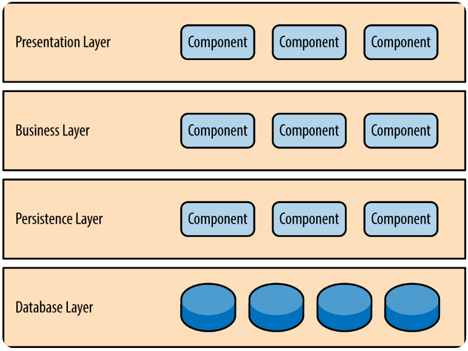

# Layered Architecture란
## Software Architecture란?
- Software Architecture(소프트웨어 아키텍처)란 소프트웨어 시스템의 전체적인 구조와 구성 요소들 간의 상호작용을 설계하는 것 
- 이를 선택할 때에는 요구사항, 복잡성, 기술 스택, 경험, 비용 및 시간등 여러 다양한 요소들을 고려하여 적절한 패턴을 선택해야함
- Software Architecture(소프트웨어 아키텍처)는 전체적인 동작과, 시스템의 성능, 확장성, 유지보수성, 보안등에 직접적인 영향을 끼침
    

## Layered  Architecture란?
- layered architecture는 시스템을 관심사별로 여러개의 계층으로 분리하여 계층화시킨 패턴을 뜻 함
- 계층들은 각자 특정 역할과 책임을 가지고 있고, 자신의 역할에만 집중함.
- 계층들은 추상화된 인터페이스로만 소통함
- 자신에게 인접한 하위 계층으로만 요청을 보낸다. (단방향 의존성)

### 4-tier Architecture
- 가장 일반적인 layered architecture로 (프레젠테이션, 비지니스, 영속성, 데이터베이스)로 구성되어 있음 

 
- Presentation Layer 
  - 사용자 혹은 클라이언트 시스템과 직접적으로 연결되는 부분  이 외에 비즈니스 로직 등은 해당 계층의 관심사가 아님

- Business Layer
  - 비즈니스 로직을 구현하는 부분이다. 실제로 시스템이 구현해야 하는 핵심 로직을 담당함 
  - Presentation Layer로 부터, 사용자의 요청을 전달받고 해당 요청을 실질적으로 처리하는 부분

- Persistence Layer
  - 데이터의 영구 저장과 관리를 담당하는 부분 
  - 웹 어플리케이션의 데이터베이스와의 상호작용을 처리하며, 데이터베이스와의 상호작용을 추상화함

- Database Layer
  - 실제 데이터베이스를 뜻함

 

## 관심사를 분리하는 이유?
- 이는 한 계층에서 변경이 발생했을 때, 다른 계층으로 전파되는 것을 방지하기 위해서이다. 

## 싱크홀 패턴이란?
- 싱크홀 패턴이란 레이어드 아키텍처처럼 하위 레이어로 갈 때 여러 하위레이어를 거치긴 하지만,   추가 작업 없이 그저 전달만 하는 경우를 뜻함 (불필요한 오버헤드)
- 이럴 때 레이어의 open하여 상위 레이어에서 직접적으로 바로 요청을 하는 방식으로 바꿀 수 있지만, 이는 트레이드 오프이기에, 적절하게 선택해야함
   선택을 할 때 일반적으로 80-20 규칙을 따름 (요청의 20%는 단순 통과 처리, 80%는 비즈니스 로직 수행)

## Layered  Architecture의 장단점?
- 장점
  - 코드의 높은 재사용성 및 유지보수성
  - 변화에 유연하게 대처
  - 테스트의 용이
- 단점
  - 높은 오버헤드
  - 복잡성