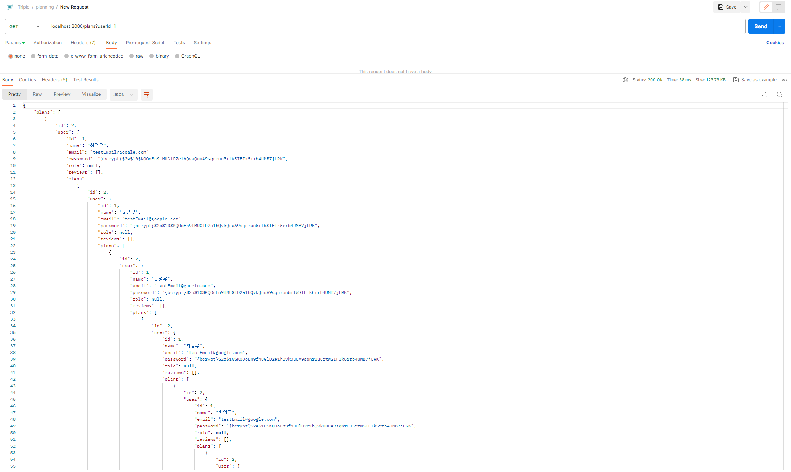
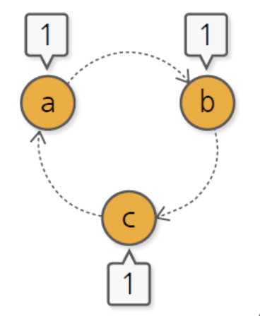
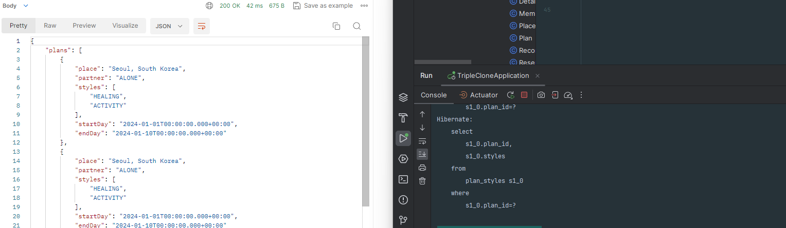

이번 Triple 클론 코딩 프로젝트를 진행하면서, 순환 참조로 인한 문제가 발생했다.

이번에는 이를 해결한 과정에 대해서 글을 써보고자 한다.

내 프로젝트에서 순환 참조가 발생한 부분은

내가 짠 계획 전체 조회와 내 예약 전체 조회를 하는 로직에서 순환 참조가 발생했다.

먼저 나의 계획 전체 조회 기능이다.

문제가 되었던 코드 먼저 보자

1.Controller

@GetMapping("/plans")
public ResponseEntity<PlanReadAllResponseDto> readPlan(@RequestParam long userId) {
PlanReadAllResponseDto responseDto = service.findAllPlan(userId);
return ResponseEntity.ok(responseDto);
}

2. Service

public PlanReadAllResponseDto findAllPlan(long userId) {
User user = userService.findById(userId);
return new PlanReadAllResponseDto(user.getPlans());
}

3. DTO

public record PlanReadAllResponseDto(
List<Plan> plans
}

Plan Entity는 User Entity와 양방향 매핑 연관관계를 가지고 있었으며, 이 api를 호출했을 당시 무한 순환 참조가 발생하는 걸 볼 수 있었다.

2024-02-28T15:46:56.205+09:00  WARN 11544 --- [nio-8080-exec-5] c.e.T.w.e.GlobalExceptionHandler         : Response already committed. Ignoring: org.springframework.http.converter.HttpMessageNotWritableException: Could not write JSON: Infinite recursion (StackOverflowError)

그래서 이 순환 참조가 왜 발생하는지, 해결하기 위해서는 어떤 방법들이 있는지, 구글링을 해보았다.

순환 참조가 발생하는 이유
순환 참조가 발생하는 이유는 양방향 매핑에 있어서 서로 참조를 하고 있을 경우에, 객체 생성 시점에서 서로가 서로의 데이터를 가져오면서 무한 루프에 빠지게 된다.

예시를 보면 클래스 a가 클래스 b를 참조하고, 클래스 b가 클래스 c를 참조하고, 마지막으로 클래스 c가 클래스 a를 참조하고 있다.

만약 클래스 a의 객체를 생성하고자 한다면, 클래스 b에 대한 정보가 필요하기에 클래스 b를 생성할텐데 그럼 클래스 b의 생성과정에서 클래스 c가 필요하고, 그럼 클래스 c의 생성과정에서 클래스 a의 생성이 필요하고....이렇게 무한 루프가 돌아버리는 것이다.

순환 참조를 해결하는 방법
순환참조를 해결하는 방법으로는 5가지 정도를 찾았다.

1. 양방향 연관관계 제거

   : 먼저 가장 근본적인 이유를 차단시키는 양방향 연관관계를 제거하는 방법이다.

순환 참조가 발생하는 이유는 위에서 봤다시피 양방향 연관관계 매핑으로 인한 무한 루프 참조로 인해 발생한다.

따라서 이 양방향 연관관계 매핑을 제거해준다면, 쉽게 해결 할 수 있다.

하지만 양방향 연관관계를 끊어주기 위해서는 정말 양방향 연관관계 매핑이 없어도 상관 없는지 잘 판단한 후에 연관관계 매핑을 제거해야만 한다

2. JSON 라이브러리 사용

    
    1. @Jsonignore 사용

       이 어노테이션을 사용하면 JSON 데이터에 해당 프로퍼티는 null로 들어가게 된다.

       즉, 데이터에 해당 어노테이션이 붙은 프로퍼티를 포함하지 않는다.

    2. @JsonManagedReference와 @JsonBackReference 사용

        : 부모 클래스의 entity의 연관관계 매핑 필드에 @JsonManagedReference를, 자식 클래스의 entity 연관관계 매핑                  
        필드에 @JsonBackReference를 추가해주면 순환 참조를 막을 수 있다.

    3. @JsonIgnoreProperties 사용

        부모 클래스의 연관관계 매핑 필드에 @JsonIgnoreProperties를 붙여주면 순환 참조를 막을 수 있다.

3. DTO사용

   : 순환 참조가 발생하는 근본적인 원인은 양방향 연관관계 매핑에 있지만 실제로 문제는 entity를 조회할 때가 아닌 조회한 entity를 JSON으로 변환할 때, 즉 entity를 직렬화 시킬 때 controller단에서 발생한다.

위에 적어놓은 내 로직을 보면 return값으로 List<Plan>을 DTO로 감싸서 return해주고 있다.

이렇게 감싸더라도 entity 자체를 return값으로 돌려줄 경우에는 직렬화 과정에서 문제가 발생하기에, 이를 DTO로 바꿔주면 문제가 해결된다.

필자는 처음으로 양방향 연관관계 제거를 시도해보았다.

@NoArgsConstructor(access = AccessLevel.PROTECTED)
@Entity(name = "userEntity")
@Getter
public class Member implements UserDetails {
@Id
@GeneratedValue(strategy = GenerationType.IDENTITY)
private long id;

    private String name;
    private String email;
    private String password;

    @ElementCollection(fetch = FetchType.EAGER)
    private List<String> roles = new ArrayList<>();

    @OneToMany(mappedBy = "member")
    private List<Review> reviews = new ArrayList<>();

    @OneToMany(mappedBy = "member")
    private List<Plan> plans = new ArrayList<>();
@Getter
@NoArgsConstructor(access = AccessLevel.PROTECTED)
@Entity
public class Plan {
@Id
@GeneratedValue(strategy = GenerationType.IDENTITY)
private long id;
@ManyToOne
@JoinColumn(name = "member_id")
private Member member;

    private String place;

    @Enumerated(EnumType.STRING)
    private Partner partner;

    @ElementCollection
    @CollectionTable(name = "plan_styles", joinColumns = @JoinColumn(name = "plan_id"))
    @Enumerated(EnumType.STRING)
    private List<Style> styles;

    private Date startDay;

    private Date endDay;

    @OneToMany(mappedBy = "plan")
    private List<DetailPlan> plans;

내 프로젝트에서 Plan을 조회하기 위해서는 Member와 함께 조회해야 했었는데 Member와 Plan은 양방향 연관관계 매핑을 가지고 있었기에, 이를 제거하기 위해 양방향 매핑이 없어도 되는지 고민했다.

양방향 연관관계 매핑을 하는 이유는 단순히 단방향 연관관계 매핑에 비해 연관관계 주인이 아닌 클래스로 부터 연관관계 주인 클래스로의 그래프 탐색이 추가될 뿐이었다.

따라서 다대일 양방향 연관관계 매핑을 다대일 단방향 연관관계 매핑으로 바꾸기 위해서는 Member 클래스에서 연관관계 참조를 제거해주면 된다.

하지만 내 로직상 양방향 매핑 관계를 제거한다면, 추후에 Plan의 수가 굉장히 많아진다면, 내 계획을 전체 조회 할 때 마다 Plan테이블 전체조회를 하면서 member Id와 동일한지 검사해서 가져와야 한다.

따라서 나는 Member가 가지고 있는 List를 조회하여 Plan을 가져오는 기능이 필요했기에 이는 불가능하다고 판단했다.

그렇다면 나에게 남은 것은 JSON 라이브러리를 사용하는 것과 DTO을 사용하는 방법이 남았는데

많은 구글링을 해본 결과 JSON라이브러리를 지양하고 DTO변환 방법을 지향해야한다는 의견이 굉장히 많았다.

왜 그런지에 대해서도 알고 싶었지만, 다들 이유는 설명하지 않고 그저 JSON라이브러리를 지양하고 DTO변환 방법을 지향해야한다는 의견만 적어놓았기에, 이에 대해서는 내가 직접 고민해보기로 했다.

JSON라이브러리를 지양하고, DTO사용을 지향해야 하는 이유가 뭘까?
나는 JSON라이브러리를 지양해야하는 이유는 모르지만, DTO를 사용했을 때의 장점은 알고있다. DTO를 사용한다면

먼저 데이터의 노출을 제어할 수 있다.

: DTO를 사용하지 않고 Entity를 그대로 return해 버린다면, 클라이언트에 필요한 데이터가 아닌 불필요한 데이터까지 전부 노출해야 하기에 이는 보안 문제를 야기할 수 도 있다.

예를 들면 Member에 대한 조회를 DTO를 사용하지 않고 Entity자체로 return할 시에는 외부로 노출되어서는 안되는 비밀번호나 회원 번호와 같은 정보들까지 전부 노출시켜야 한다.

두번째로는 의미 있는 응답을 제공할 수 있다.

: Entity의 모든 정보를 제공하는 것보다 클라이언트에게 필요한 정보만 전송하는 것이 클라이언트가 정보를 이해하는데에도 훨씬 도움이 되고, 더 효율적인 통신이 가능해진다.

마지막으로는 직렬화 문제 해결이다.

: JSON 라이브러리는 객체를 직렬화할 때 순환 참조가 있는 경우 스택 오버플로우(StackOverflow) 오류가 발생할 수 있다. 이는 객체를 JSON으로 변환하는 과정에서 무한한 재귀 호출이 발생하기 때문이고, 반면에 DTO 변환 방법은 객체 간의 순환 참조를 방지하고, 필요한 데이터만을 전송하기 때문에 이러한 문제를 피할 수 있다.

그에 비해 JSON라이브러리를 사용한 순환 참조 문제 해결 방법은 단순히 그 기능만 하기에 JSON라이브러리를 사용할 바에 더 많은 장점을 제공해주는 DTO 방식이 더 효율적이기에 DTO사용을 지향해야 하는 것 아닐까?

(이 모든건 필자의 개인적인 생각입니다, 틀릴 가능성이 높습니다)

따라서 나는 순환 참조 문제를 해결하기 위해 DTO를 사용하도록 하였고, 문제가 되는 entity 직접 사용을 모두 DTO로 변환해주었다.

public record PlanReadAllResponseDto(
List<PlanReadResponseDto> plans
) {
}
public record PlanReadResponseDto(
String place,
Partner partner,
List<Style> styles,
Date startDay,
Date endDay
)

return 타입을 entity가 아닌 DTO로 변환 해주니, 순환 참조의 문제는 바로 해결할 수 있었다.

결과

추후에 왜 JSON라이브러리를 지양해야하고, DTO를 지향해야하는지는 더 찾아보고 글을 수정해야겠다.

참고

[JPA] 양방향 순환참조 문제 및 해결방법 (tistory.com)