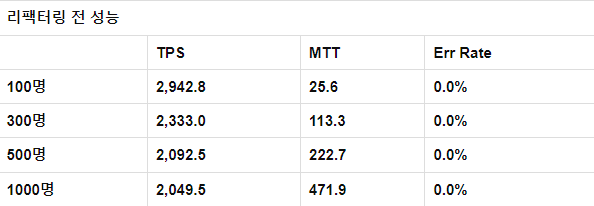
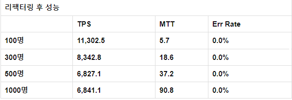

## Trilple 클론 코딩 프로젝트를 진행하면서, 특정 게시물에 대해 좋아요를 누르는 기능이 요구되었다.

## 이번 글은 좋아요 기능에 대한 성능을 어떻게 개선했는지에 대한 기록이다.

초기의 코드 (좋아요 기능이 아닌 일부 기능 제외)

public class Place {
@ElementCollection
@CollectionTable(name = "place_like", joinColumns = @JoinColumn(name = "place_id"))
private List<Long> likes = new ArrayList<>();

    public void like(long userId) {
        if (isLikedBy(userId)) {
            likes.remove(userId);
            return;
        }
        likes.add(userId);
    }

    public boolean isLikedBy(long userId) {
        return likes.contains(userId);
    }

public class RecommendService {
public void like(long placeId, long userId) {
Place place = placeRepository.findById(placeId)
.orElseThrow(NoSuchElementException::new);

        place.like(userId);
    }
}

초기의 코드는 단순히 좋아요 기능 호출을 하면 그에 맞게 즉시 DB에 연결해서 데이터를 수정하는 방식이었다.

물론 이렇게만 하더라도 기능적으로는 문제가 없지만, 하지만 이러한 방식의 코드는 한번의 요청마다

요청에 대한 user가 좋아요를 앞전에 눌렀는지에 대한 조회와 게시물이 존재하는지에 대한 조회, 좋아요 리스트 수정까지

총 3개의 쿼리가 날라가야 했기에, 한 사람이 좋아요를 연속으로 여러번 누르게 되거나, 좋아요 이벤트를 진행하게 되어서 많은 트래픽이 들어온다면, 하나의 요청마다 한번의 DB연결 + DB에 쿼리 전송이 수행된다.

이러한 방식의 로직은 많은 트래픽에는 너무 안좋은 성능을 보일 뿐 아니라, DB에 부하가 너무 커져서 오류가 발생할 수 도 있다.

- 그럼 어떻게 고치지??

그렇다면 대용량으로 트래픽이 들어와도 문제가 없도록 하기 위해서는 어떤 방법을 선택해야 할지 고민이었다.

물론 다른 회사의 개선 방식이나, 다른 개발자 분들의 개선 방식을 구글링 해본다면 많은 좋은 방법을 알 수 있을테지만,

나는 먼저 나 스스로 고민하고 개선시켜보기로 했다.

어떻게 리팩터링해야할지 고민해본 결과, 나는 벌크 연산을 통해 DB 커넥션을 줄여서 DB에 대한 부하를 줄이고자 했다.

벌크 연산이란?

= 여러개의 쿼리를 각 요청마다 보내지 않고 모아놨다가 한번에 쿼리를 날리는 방식을 의미한다.

그렇다면 리팩터링을 하기 전과 후의 성능 비교를 위해 성능테스트 툴을 선택해야한다.

성능 테스트 툴에도 nGrinder, loadrunner, JMeter, Gatling, vegeta, Wrk 등등...여러가지가 있지만

이 중 유로이거나, 잘 사용되지 않는 툴을 제외하면 nGrinder, JMeter가 있었고, 좀 더 보기 좋은 UI를 가진 nGrinder를 선택했다.

nGrinder를 다운받아 설정하고 테스트를 하는 과정도 기록을 해놨지만, 이는 블로깅을 할 정도의 내용은 아니라 판단하여,

가볍게 넘어가겠다.

vuser를 100명, 300명, 500명, 1000명으로 나누어 테스트 해보았고, 결과는 위와 같았다.

이제 리팩터링을 해보자.   

벌크연산을 하기 위해서는 바로 DB에 저장하는 것이 아니라, 임시로 업데이트 내용을 저장해 놨다가 한번에 쿼리를 날려야 한다. JPA는 벌크 연산을 지원하고 있기에 하나의 데이터에 대한 업데이트가 아닌 여러개의 데이터에 대한 업데이트의 경우에는 더티체킹을 통해 자동으로 벌크연산을 수행한다.

먼저 다시 한번 리팩터링의 목표를 잡고 가자면, 나는 DB 커넥션을 최대한 줄여 DB의 부하를 줄여주는 것이 목표이다.

그러기 위해 나는 좋아요 요청을 먼저 Map<게시물 id, List<유저 id>>에 저장을 해두었다가 Spring Batch를 사용해 5초마다 한번씩 DB에 업데이트를 해줄 수 있도록 코드를 리팩터링 해보았다.

public RecommendService {
public void like(Long placeId, Long userId) {
if (likes.containsKey(placeId)) {
if (likes.get(placeId).contains(userId)) {
likes.get(placeId).remove(userId);
} else {
likes.get(placeId).add(userId);
}
} else {
likes.put(placeId, new ArrayList<>());
likes.get(placeId).add(userId);
}
}

    @Scheduled(fixedRate = 5000)
    @Transactional
    public void saveLike() {
        if (!likes.isEmpty()) {
            Set<Long> updateList = likes.keySet();

            for (Long placeId : updateList) {
                Place target = placeRepository.findById(placeId)
                        .orElseThrow(NoSuchElementException::new);

                for (Long userId : likes.get(placeId)) {
                    target.like(userId);
                }
            }
            likes.clear();
        }
    }
    }

이 때 나는 HashMap과 ArrayList를 사용하였는데 테스트를 해본 결과  거의 100%에 육박하는 오류율을 보였다.....

왜일까 생각하며, 오류 로그를 확인 해보니, HashMap과 ArrayList는 멀티스레드를 지원하지 않기에 동시에 여러 접근이 들어와서 오류가 발생했던 것이다.

이를 해결하기 위해서는 멀티스레드에 안전한 Collection을 사용하거나 synchronized를 사용하여 동시성 문제를 해결해 주어야 하는데, 먼저 synchronized를 사용하여 보았더니 이번에는 JSON요청을 DTO로 변환하는데 문제가 발생했다....ㅜㅜ

오류의 내용인 즉슨 특정 field에 대한 setter나 생성자를 찾지 못해 변환할 수 없다는 내용이었지만, 나는 record를 사용하고 있던지라 그럴 가능성은 없었다....결국 이를 해결하지 못한 채로 멀티스레드에 안전한 Collection을 사용하기로 했다..

(추후에 좀 더 찾아보고 공부할 예정)

HashMap을 ConcurrentHashMap으로, ArrayList를 ConcurrentLinkedDeque로 변경을 해주었고,

 
확실히 성능상의 이점을 볼 수 있었다.

리팩터링 전과 비교하여

TPS : 250.4375% 향상
MTT : 81.365% 감소
의 성능 개선을 할 수 있었다.

물론 이렇게 해놓고 끝낼 수 도 있었지만, 난 그저 내 생각만으로 성능을 개선했지, 다른 사람들은 어떻게 개선했는지 또는 다른 회사에서는 어떤 방식으로 개선하였는지, 지금 이 성능이 최선인지 알 수 없었다.

따라서 다른 사람들은 어떻게 개선했는지, 내 코드와 비교해서 장단점이 무엇인지, 최선의 코드가 무엇인지 기록해보고,

성능 테스트 또한 정확한 요구사항을 정리하여 제대로 해본 후에 추가적인 블로깅을 해야겠다.